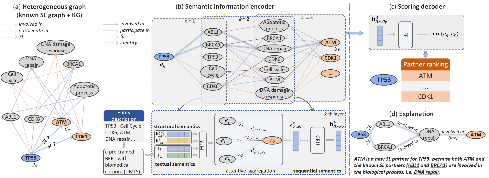

# KR4SL
Knowledge Graph Reasoning for Explainable Prediction of Synthetic Lethality
 
 
## Dataset description
We have provided the processed dataset. The SL gene pairs we used are derived from [SynLethDB-v2.0](http://synlethdb.sist.shanghaitech.edu.cn/v2/#/). To construct a knowledge graph containing more relation types, we first use the knowledge about genes and their functions [SynLethKG](http://synlethdb.sist.shanghaitech.edu.cn/v2/#/), i.e. five types of entities include Gene, Pathway and three types of GO terms (biological processes (BP), molecular functions (MF) and cellular components (CC)). Four types of relations are included to describe if a gene is involved in a pathway or annotated with a GO term, namely, Participate_in_PW, Participate_in_BP, Participate_in_MF, and Participate_in_CC. We then expand the relation types of gene-GO and GO-GO, using the data from [OntoProtein] (https://github.com/zjunlp/OntoProtein). See `kg.txt` in data folder for the complete KG.

To utilize the pre-trained textual embedding, one can take `all_entities.txt` in data folder as the input and use the pre-trained BERT model named [CODER](https://github.com/GanjinZero/CODER) to get textual embeddings for each entity.

## Running
Extract textual embeddings
```
python extract_pretrain_emb.py
```

For transductive reasoning
```
cd transductive
python -W ignore train.py --suffix trans_reason
```
For inductive reasoning
```
cd inductive
python -W ignore train.py --suffix ind_reason
```

## Requirements
```
python36
torch 1.11.0
torch scatter 2.0.9
transformers 4.23.1
```

## Acknowledgement
Partial code is adapted from [Zhang and Yao 2022](https://arxiv.org/pdf/2108.06040.pdf) with the repository https://github.com/AutoML-Research/RED-GNN.
